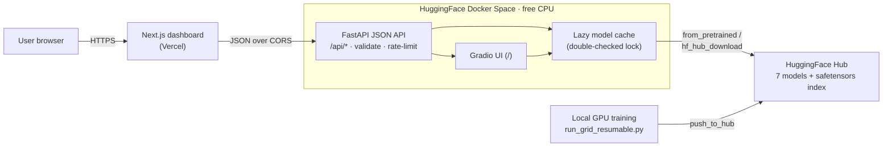

# Transfer Learning & HuggingFace Model Hub Showcase

[](https://github.com/shiva-shivanibokka/Transfer-Learning-HuggingFace/actions/workflows/ci.yml)


**🚀 [Live Demo](https://transfer-learning-hugging-face-git-main-shiv-a.vercel.app/)** (custom Next.js frontend on Vercel) · **[API + Gradio (HF Space)](https://huggingface.co/spaces/shiva-1993/transfer-learning-project)** · **🤗 [Models](https://huggingface.co/shiva-1993)**

> **Architecture:** **Next.js/Vercel** frontend → **FastAPI** JSON API on a **Hugging Face Docker Space** → **7 fine-tuned models + a safetensors retrieval index** loaded from the **HF Hub** at runtime. Frontend code lives in [`frontend/`](frontend/).

---

## Recruiter TL;DR

- **What it is:** An end-to-end transfer-learning study — **4 vision backbones** (ResNet-50, EfficientNet-B0, ViT-Base, DINOv2-Base), **2 text encoders** (RoBERTa, ModernBERT), and **CLIP** — trained on satellite imagery and emotion text, then served as a **live 3-tier web app** (React → FastAPI → HuggingFace Hub).
- **Hardest problem solved:** Turning a research notebook into a **production serving stack** — a hardened JSON API (input validation, per-IP rate limiting, pickle-free `safetensors` loading, a CVE-gated dependency floor), lazy model loading from the Hub behind a thread-safe cache, and a **race-safe custom frontend** — all running on a free CPU tier.
- **Impact (measured):** DINOv2's **frozen linear probe hits 95.4%** (≈ others' *fully fine-tuned* accuracy with zero backbone training); **EfficientNet-B0 reaches 98% at 6 ms/image** (ONNX); temperature scaling **reduced calibration error (ECE) on every text model**. Backed by a live demo and **28 automated tests**.

---

An empirical study of transfer learning efficiency across **4 vision architectures** and **2 text encoders** on a niche satellite domain, plus a CLIP zero-shot/prompt study. It answers three questions:

1. Does DINOv2's self-supervised pretraining transfer better than supervised ViT to satellite imagery?
2. At what labeled-data crossover point does CLIP zero-shot beat a fine-tuned CNN?
3. How sensitive is CLIP zero-shot accuracy to prompt wording — and does ensembling recover it?

---

## Key Results

**Three findings, from the experiments below:**

1. **Self-supervised features transfer far better *frozen*.** DINOv2's **linear probe hits 95.4%** — its frozen features nearly match everyone else's *fully fine-tuned* models, while the CNNs' linear probes languish at ~78%. A **17-point gap** with zero backbone training.
2. **…but full fine-tuning DINOv2 on scarce data backfires.** At 1% data, full fine-tune collapses to **29%** (overfitting 86M params on 162 images), whereas **ViT-Base stays at 90.5%**. Lesson: freeze DINOv2, fine-tune ViT.
3. **CLIP zero-shot is weak *and* prompt-fragile on satellite imagery.** Accuracy swings **42%→52%** across five prompt templates; a **5-template ensemble recovers to 53.1%** — but that is still far below a fine-tuned CNN's linear probe (78%), so *any* labeled data makes fine-tuning the better choice.

### Vision: Strategy Comparison (EuroSAT, 100% data)

Test accuracy by fine-tuning strategy. Latency is single-image PyTorch CPU inference (ONNX in parentheses).

| Model | Family | Year | Linear Probe | Partial Unfreeze | Full Fine-tune | CPU Latency (ms) |
|---|---|---|---|---|---|---|
| ResNet-50 | CNN | 2015 | 77.8% | 98.0% | 98.5% | 589 (23 ONNX) |
| EfficientNet-B0 | CNN | 2019 | 79.5% | 92.9% | 98.0% | **25 (6 ONNX)** |
| ViT-Base | Transformer | 2020 | 88.9% | 96.2% | **99.0%** | 1040 (590 ONNX) |
| DINOv2-Base | Self-supervised | 2023 | **95.4%** | 97.8% | 96.9% | 131 (163 ONNX) |

*EfficientNet-B0 is the deployment sweet spot: 98% accuracy at 6 ms/image (ONNX). ViT-Base is most accurate but ~100× slower.*

### Vision: Data Efficiency (full fine-tune, test accuracy)

| Model | 1% data | 5% data | 10% data | 100% data |
|---|---|---|---|---|
| ResNet-50 | 47.3% | 87.4% | 95.5% | 98.5% |
| EfficientNet-B0 | 62.4% | 88.2% | 95.0% | 98.0% |
| ViT-Base | **90.5%** | **94.2%** | **97.2%** | **99.0%** |
| DINOv2-Base | 29.1% | 66.5% | 91.1% | 96.9% |

*ViT-Base is remarkably data-efficient — 90.5% from just 162 labeled images. DINOv2 full fine-tune is the opposite: it needs data (or, better, a frozen probe — see 95.4% above).*

### Text: RoBERTa vs ModernBERT + Calibration (dair-ai/emotion)

DistilBERT included as an efficiency reference. ECE = Expected Calibration Error (lower is better); temperature scaling is fit on the validation set.

| Model | Test Acc | F1 Macro | ECE Before | ECE After | Temperature T |
|---|---|---|---|---|---|
| RoBERTa | 92.7% | 87.9% | 0.0288 | **0.0230** | 1.169 |
| ModernBERT | 92.7% | **88.9%** | 0.0386 | **0.0305** | 1.293 |
| DistilBERT (ref) | 92.9% | 88.5% | 0.0308 | 0.0273 | 1.157 |

*All three land within 0.2% accuracy; ModernBERT edges F1. Temperature scaling reduces calibration error in every case (T > 1 ⇒ the raw models were mildly overconfident).*

### CLIP: Prompt Sensitivity (EuroSAT zero-shot)

| Prompt Template | Accuracy |
|---|---|
| "a photo of {cls}" | 42.1% |
| "a satellite image of {cls} land use" | 49.8% |
| "an aerial photograph showing {cls}" | 43.2% |
| "a remote sensing image of {cls}" | 45.6% |
| "{cls} viewed from above" | 51.5% |
| **Ensemble (all 5)** | **53.1%** |

*Domain-aware prompts beat the generic "a photo of" by ~10 points; averaging text embeddings across all five templates beats the best single template.*

> Reproduce: `python scripts/run_grid_resumable.py` (vision + text + CLIP), then `python scripts/build_clip_index.py`. Trained on an RTX 4060.

---

## Architecture

Three tiers, so a fast static UI is decoupled from a heavier inference backend, and trained models live independently on the Hub (the serving image ships **no weights** and stays tiny for fast free-tier cold starts).



**Why it's shaped this way**
- **One process, one inference path.** The JSON API (`app/api.py`) *reuses* the exact loaders from the Gradio module (`app/gradio_app.py`), mounted together via `gr.mount_gradio_app`. Two services would mean two model caches and double the memory/cold-start cost on a single free CPU box. `app/serve.py` is a stable module entrypoint (`uvicorn app.serve:app`) so the API and UI can't split the cache.
- **Models on the Hub, lazy-loaded + cached.** First request per model downloads it (cached thereafter) behind a **double-checked lock** so concurrent cold requests don't double-load an 86M-param model.
- **Single sources of truth.** `src/utils/paths.py` is the one definition of the train→serve artifact contract (it previously drifted and the app silently served random weights); class label order, `MAX_CLIP_K`, and `HF_HUB_USER` are each defined once. See [`docs/adr/0001-artifact-path-contract.md`](docs/adr/0001-artifact-path-contract.md).

---

## Tech Stack

| Layer | Choices | Why |
|---|---|---|
| **ML** | PyTorch 2.6, HuggingFace `transformers` / `Trainer`, `timm`, scikit-learn, ONNX | `Trainer` avoids reimplementing the loop while keeping control via callbacks; ONNX for a deployable, faster inference graph |
| **Serving** | FastAPI + Gradio (mounted together), `uvicorn`, `slowapi`, `safetensors` | One process serves a JSON API *and* a UI; `slowapi` for per-IP rate limiting; `safetensors` to load the retrieval index with no pickle/RCE surface |
| **Frontend** | Next.js 16, React 19, TypeScript, Tailwind v4, Recharts | Client-rendered dashboard on Vercel; hand-rolled `fetch` + hooks (minimal deps); Recharts only for the results chart |
| **Infra** | Docker (CPU-only, non-root), HuggingFace Spaces + Hub, Vercel, GitHub Actions | CPU-only torch wheel (~200 MB vs multi-GB CUDA) for fast cold starts; models hosted on the Hub |
| **Tracking** | MLflow | Per-run params/metrics/artifacts via a custom callback |

Dependency floors are deliberate: **`torch>=2.6`** because `transformers>=4.53` blocks loading legacy `.bin` checkpoints on older torch (CVE-2025-32434), and CLIP's Hub weights are `.bin`-only.

---

## Skills Demonstrated

- **Production ML deployment / MLOps** — model serving decoupled from training; 7 models + a retrieval index published to and lazy-loaded from the HuggingFace Hub.
- **RESTful API design** — a FastAPI JSON API with typed request models and meaningful HTTP status semantics (400 / 413 / 429 / 502).
- **System design & architecture** — documented 3-tier design, an ADR for the train→serve contract, and single-source-of-truth invariants to eliminate drift bugs.
- **Application security & hardening** — input-size/decompression-bomb validation, per-IP rate limiting, pickle→`safetensors` migration, and CVE-gated dependency pinning.
- **Containerization & Docker** — a slim, non-root, layer-cached CPU image for a free serving tier.
- **CI/CD** — GitHub Actions with lint, tests, a Docker-build validation job, and advisory security auditing.
- **Observability** — structured stdout logging (captured by HF Spaces) and a `/health` liveness endpoint.
- **Full-stack development** — a TypeScript/React frontend with async race-safety (AbortController + monotonic request-ids) against a slow, sleeping backend.
- **Applied deep learning** — transfer-learning strategy comparison, model calibration (temperature scaling / ECE), and CLIP zero-shot / prompt engineering / retrieval.

---

## Getting Started

```bash
git clone https://github.com/shiva-shivanibokka/Transfer-Learning-HuggingFace
cd Transfer-Learning-HuggingFace

pip install -r requirements.txt        # full training stack
# ...or, to serve the demo only:
pip install -r requirements-app.txt

cp .env.example .env                   # optional: add HF_TOKEN to push models to the Hub
```

Run the tests and linter:

```bash
pip install -r requirements-dev.txt
pytest -q
ruff check .
```

### Running experiments

```bash
# Vision: single quick run (EfficientNet, full fine-tune, 10% data)
python scripts/train_vision.py --model efficientnet_b0 --strategy full_finetune --fraction 0.1

# Vision: full strategy-comparison / data-efficiency studies
python scripts/train_vision.py --study strategy_comparison
python scripts/train_vision.py --study data_efficiency

# Text: train all models + calibration
python scripts/train_text.py

# CLIP: zero-shot + few-shot + retrieval
python scripts/train_clip.py

# Reproduce the entire grid (idempotent + resumable), then build the retrieval index
python scripts/run_grid_resumable.py
python scripts/build_clip_index.py

mlflow ui --port 5000                  # optional: browse tracked runs
```

### Notebooks (run in order)

```bash
jupyter notebook
# notebooks/01_vision_cnn_vit_dinov2.ipynb
# notebooks/02_text_roberta_modernbert_calibration.ipynb
# notebooks/03_clip_zeroshot_prompt_engineering.ipynb
```

### Run the serving app locally

```bash
# Runs the FastAPI JSON API + the Gradio UI in one process (matches production).
uvicorn app.serve:app --host 0.0.0.0 --port 7860
# Gradio UI at http://localhost:7860/  · JSON API at http://localhost:7860/api/*  · /health
```

The custom Next.js frontend lives in [`frontend/`](frontend/) (`npm install && npm run dev`); point it at a backend with `NEXT_PUBLIC_API_URL`.

---

## Testing

Real, running suite — **28 tests** covering the deterministic core: the artifact-path contract, metrics/ECE math, stratified data sampling, attention-rollout (including the real app path, not just synthetic tensors), the model freeze-strategy logic, and FastAPI `TestClient` contract tests for the API's validation/error paths.

```bash
pytest -q            # 28 passed
ruff check .         # lint (E/F/I)
```

CI ([`.github/workflows/ci.yml`](.github/workflows/ci.yml)) runs three jobs: **lint-and-test** (ruff + advisory mypy + pytest with coverage), **docker-build** (validates the serving image builds before it hits the Space), and an advisory **security-audit** (`pip-audit`). Heavy/networked tests `importorskip` themselves so CI stays fast on the lightweight `requirements-ci.txt`; CI is pinned to the same `torch>=2.6` floor as production.

---

## Deployment — Hugging Face Spaces (free CPU tier)

Deployed as a **Docker Space** that loads the fine-tuned models **from the Hub at runtime** — the Space ships no weights, stays tiny, and every model is independently published and reusable.

**Flow:** train locally (GPU) → publish models to the Hub → the Space pulls them on demand.

```
scripts/run_grid_resumable.py   # train vision + text + CLIP (resumable grid)
scripts/build_clip_index.py     # build the safetensors CLIP retrieval index
scripts/push_models_to_hub.py   # publish the 7 models to the Hub
→ app/serve.py (uvicorn) loads shiva-1993/eurosat-* and emotion-* via from_pretrained
```

### Published artifacts (Hugging Face Hub)
- **Vision:** [`eurosat-resnet50`](https://huggingface.co/shiva-1993/eurosat-resnet50), [`eurosat-efficientnet-b0`](https://huggingface.co/shiva-1993/eurosat-efficientnet-b0), [`eurosat-vit-base`](https://huggingface.co/shiva-1993/eurosat-vit-base), [`eurosat-dinov2-base`](https://huggingface.co/shiva-1993/eurosat-dinov2-base)
- **Text:** [`emotion-roberta`](https://huggingface.co/shiva-1993/emotion-roberta), [`emotion-modernbert`](https://huggingface.co/shiva-1993/emotion-modernbert), [`emotion-distilbert`](https://huggingface.co/shiva-1993/emotion-distilbert)
- **CLIP index:** [`eurosat-clip-index`](https://huggingface.co/datasets/shiva-1993/eurosat-clip-index) (dataset; `retrieval_index.safetensors`)

### Reproduce the deployment
```bash
huggingface-cli login                                # write token
python scripts/push_models_to_hub.py --user <you>    # publish models
python scripts/build_clip_index.py                   # build the safetensors index (then upload it to your dataset repo)
# Point the app at your account:  HF_HUB_USER=<you>
# Push app/ src/ configs/ requirements-app.txt Dockerfile README.md to a Docker Space
```

The Dockerfile installs only `requirements-app.txt` (CPU torch, slim inference set), runs as a non-root user, and starts `uvicorn app.serve:app`. Free CPU Spaces sleep after idle; the first request after a cold start downloads the model from the Hub (cached thereafter). A `/health` endpoint and per-request latency logging are built in.

### Security & production hardening
The public inference API is treated as a real endpoint, not a toy:
- **Input validation before any model load** — base64 size, image-dimension, and text-length caps (`400`/`413`), plus `Image.MAX_IMAGE_PIXELS` to defuse decompression bombs.
- **Per-IP rate limiting** (`slowapi`, 20/min → `429`) on the expensive POST endpoints.
- **No arbitrary-code deserialization** — the CLIP retrieval index is loaded from `safetensors` (plain tensors) rather than a pickle; checkpoints load with `weights_only=True`.
- **CVE-gated dependencies** — `torch>=2.6` (CVE-2025-32434), `Pillow>=11.4`, enforced identically in CI and the serving image.
- **Fail-soft** — generic client error messages with full server-side logging; graceful degradation (attention overlay and calibration default safely if unavailable).

---

## Project Structure

```
Transfer-Learning-HuggingFace/
├── configs/                    # Single source of truth for models/strategies/hyperparams
│   ├── vision_config.py        #   Model registry, freezing strategies, data fractions
│   ├── text_config.py          #   Text registry + calibration config
│   └── clip_config.py          #   CLIP model, prompt templates, class descriptions
├── src/
│   ├── vision/                 # model.py (factory + freeze strategy) · trainer.py (HF Trainer + ONNX)
│   ├── text/trainer.py         # Text fine-tuning + temperature-scaling calibration
│   ├── clip/pipeline.py        # Zero-shot, prompt ensembling, few-shot probe, retrieval
│   └── utils/                  # data · metrics (ECE, temperature, latency) · paths (train→serve contract)
│       │                       #   · visualization (confusion matrix, reliability, attention rollout) · logging · mlflow
├── app/                        # Serving layer (deployed to the HF Space)
│   ├── api.py                  #   FastAPI JSON API (/api/*): validation, rate limiting, single-pass latency
│   ├── gradio_app.py           #   Shared inference engine + 4-tab Gradio UI + build_app() composition root
│   ├── serve.py                #   ASGI entrypoint (uvicorn app.serve:app)
│   └── results_data.py         #   Static results + model registry + class-label source of truth
├── frontend/                   # Next.js 16 + React 19 + TS dashboard (deployed on Vercel)
├── scripts/                    # CLI: train_{vision,text,clip} · run_grid_resumable · build_clip_index · push_models_to_hub
├── notebooks/                  # 01 vision · 02 text+calibration · 03 CLIP
├── tests/                      # pytest suite (paths, metrics, sampling, rollout, freeze logic, API endpoints)
├── docs/adr/                   # Architecture decision records
├── Dockerfile                  # CPU-only, non-root HF Spaces image
├── .github/workflows/ci.yml    # lint-and-test · docker-build · security-audit
└── results/                    # Per-run JSON/CSV results (weights are gitignored; served from the Hub)
```

---

## What's technically distinctive

| Feature | Why it stands out |
|---|---|
| **DINOv2** (Meta AI 2023) | Self-supervised ViT pretraining, benchmarked against supervised backbones |
| **ViT attention rollout** | Correct ViT visualization (Abnar & Zuidema 2020) — Grad-CAM is invalid for ViTs |
| **Temperature scaling / ECE** | Real classification-model calibration, shown live (raw vs calibrated) |
| **ModernBERT** (2024) | 2024 BERT successor (RoPE + Flash Attention) vs RoBERTa |
| **CLIP prompt sensitivity + ensembling** | Quantifies zero-shot variance across 5 prompts and recovers it (Radford et al. 2021) |
| **ONNX export + latency benchmark** | Latency-vs-accuracy deployment answer (p50/p95, warmup) |
| **3-tier production serving** | Custom React frontend → hardened FastAPI API → HF Hub, not just a notebook |

---

## Roadmap / Known limitations

- **Single-seed experiments.** The data-efficiency numbers (especially at 1%) are from one seed and carry real variance; multi-seed averaging with confidence intervals would strengthen the curves.
- **No runtime validation of the API contract on the frontend.** The TypeScript types are compile-time only — a backend shape change would surface at runtime; runtime parsing (e.g. `zod`) or OpenAPI codegen would close this.
- **In-process cache and rate limiter.** Fine for a single Space, but they don't coordinate across replicas; horizontal scaling would need a shared store.
- **Config documents some intent not yet wired** (e.g. discriminative learning rates) — flagged in code, worth wiring or removing.

---

## License

No `LICENSE` file is currently included — the code is shared for portfolio/demonstration purposes. Add a license (e.g. MIT) before reuse or contribution.

---

## References

- [An Image is Worth 16x16 Words (Dosovitskiy et al., 2020)](https://arxiv.org/abs/2010.11929)
- [DINOv2 (Oquab et al., 2023)](https://arxiv.org/abs/2304.07193)
- [Learning Transferable Visual Models From Natural Language (Radford et al., 2021)](https://arxiv.org/abs/2103.00020)
- [On Calibration of Modern Neural Networks (Guo et al., 2017)](https://arxiv.org/abs/1706.04599)
- [Quantifying Attention Flow in Transformers (Abnar & Zuidema, 2020)](https://arxiv.org/abs/2005.00928)
- [ModernBERT (Warner et al., 2024)](https://arxiv.org/abs/2412.13663)
